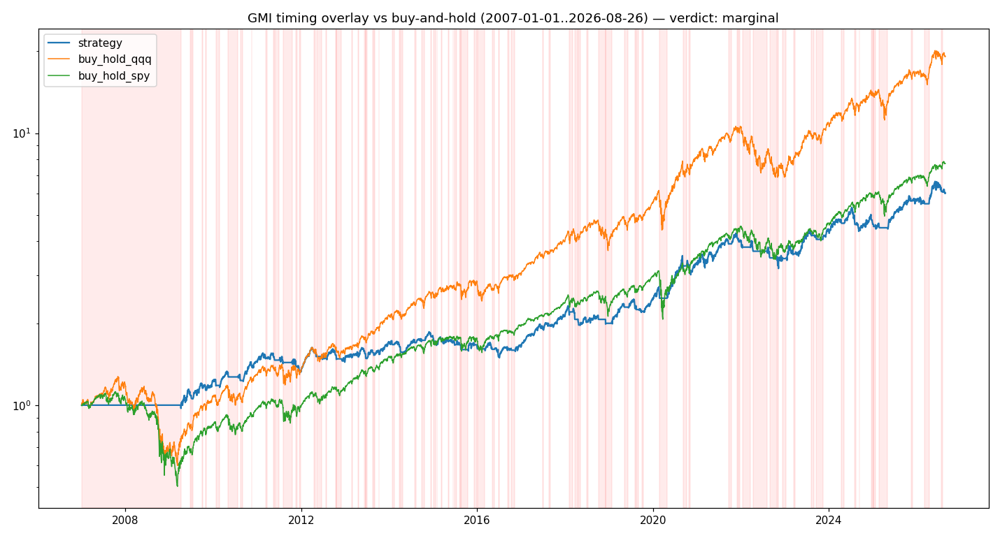

# Backtest — does the GMI timing overlay beat buy-and-hold QQQ?

**The rule (pre-stated, zero fitted parameters):** be long QQQ when the reconstructed [GMI](gmi.md) has been >= 4 for two consecutive days; sit in cash once it has spent two consecutive days *below* 3. A reading of exactly 3 is his hold state and does not flip the signal -- see [the signals](gmi.md#the-signals--buy-sell-and-the-hold-state-at-3). Signals on the close of day D, executed at the next day's open (modelled as a 1-day lag, close-to-close). Cost: 5 bps per round trip; no tax (an IRA). Period: 2007-01-01-2026-08-26. Benchmark: buy-and-hold QQQ. **Verdict criteria, fixed in advance:** "adds value" iff the default beats B&H QQQ on Sharpe *and* has <= 0.7x its max drawdown *and* the conclusion is robust across the variant grid; "marginal" if it cuts drawdown at a Sharpe/CAGR cost; "drag" if it underperforms on Sharpe and doesn't cut drawdown. (Caveat: the reconstructed GMI reads optimistic in declines -- ~78% GREEN/RED agreement with his reported GMI -- so this likely *understates* how defensive he actually was; see the breadth-data design spec.)

## Headline result

- **Strategy:** CAGR 9.6% · maxDD -25.8% · Sharpe 0.77 · Sortino 0.82 · Calmar 0.37 · in-mkt 64% · 84 trades · win 24%
- **Buy-and-hold QQQ:** CAGR 16.2% · maxDD -53.4% · Sharpe 0.79 · Sortino 1.02 · Calmar 0.30
- **Buy-and-hold SPY:** CAGR 11.0% · maxDD -55.2% · Sharpe 0.63 · Sortino 0.77 · Calmar 0.20
- **Plain 'QQQ > rising 30-week SMA' filter:** CAGR 11.0% · maxDD -25.2% · Sharpe 0.76 · Sortino 0.84 · Calmar 0.44 · in-mkt 74% · 28 trades · win 30%

### Verdict: **marginal — cuts drawdown (max-DD 26% vs 53%) but at a Sharpe/CAGR cost (Sharpe 0.77 vs 0.79); a stomach-vs-money trade**

*(Strategy vs buy-and-hold QQQ vs SPY, log scale, RED periods shaded — also at [https://litter.catbox.moe/e1q490.png](https://litter.catbox.moe/e1q490.png) for 72 h)*

## Robustness grid

Each row varies one dimension vs the default. **Picking the best-looking variant after the fact would be data snooping** -- the headline is the default, full-period, no tuning.

| variant | result |
|---|---|
| **default (GMI>=4 in, below 3 out, 2/2 confirm, 5 bps)** | CAGR 9.6% · maxDD -25.8% · Sharpe 0.77 · Sortino 0.82 · Calmar 0.37 · in-mkt 64% · 84 trades · win 24% |
| GMI>=3 | CAGR 10.0% · maxDD -34.9% · Sharpe 0.77 · Sortino 0.84 · Calmar 0.29 · in-mkt 68% · 105 trades · win 21% |
| GMI>=6 | CAGR 6.4% · maxDD -25.3% · Sharpe 0.63 · Sortino 0.57 · Calmar 0.25 · in-mkt 51% · 58 trades · win 26% |
| symmetric exit (<4) | CAGR 7.4% · maxDD -22.8% · Sharpe 0.65 · Sortino 0.66 · Calmar 0.32 · in-mkt 60% · 122 trades · win 22% |
| confirm 0/0 | CAGR 7.7% · maxDD -31.6% · Sharpe 0.66 · Sortino 0.68 · Calmar 0.24 · in-mkt 63% · 152 trades · win 19% |
| confirm 5/5 | CAGR 7.7% · maxDD -31.5% · Sharpe 0.62 · Sortino 0.64 · Calmar 0.24 · in-mkt 66% · 45 trades · win 30% |
| confirm 2/1 | CAGR 6.8% · maxDD -27.4% · Sharpe 0.61 · Sortino 0.61 · Calmar 0.25 · in-mkt 59% · 124 trades · win 20% |
| +Stage-2 | CAGR 7.2% · maxDD -20.1% · Sharpe 0.66 · Sortino 0.64 · Calmar 0.36 · in-mkt 57% · 78 trades · win 23% |
| +QQQ-short-term-up | CAGR 8.8% · maxDD -25.4% · Sharpe 0.78 · Sortino 0.78 · Calmar 0.34 · in-mkt 58% · 103 trades · win 23% |
| +Stage-2 +ST-up | CAGR 6.7% · maxDD -19.8% · Sharpe 0.67 · Sortino 0.62 · Calmar 0.34 · in-mkt 52% · 95 trades · win 22% |
| reported GMI | CAGR 9.2% · maxDD -32.6% · Sharpe 0.66 · Sortino 0.68 · Calmar 0.28 · in-mkt 64% · 81 trades · win 27% |
| RED->SQQQ | CAGR -23.0% · maxDD -99.0% · Sharpe -0.30 · Sortino -0.34 · Calmar -0.23 · in-mkt 71% · 79 trades · win 30% |
| GREEN->TQQQ | CAGR 24.3% · maxDD -61.0% · Sharpe 0.74 · Sortino 0.83 · Calmar 0.40 · in-mkt 71% · 79 trades · win 23% |
| cost 20bps | CAGR 8.2% · maxDD -27.1% · Sharpe 0.67 · Sortino 0.72 · Calmar 0.30 · in-mkt 64% · 84 trades · win 23% |
| cost 0bps | CAGR 10.1% · maxDD -25.3% · Sharpe 0.81 · Sortino 0.85 · Calmar 0.40 · in-mkt 64% · 84 trades · win 24% |

## When did it help / hurt? (rolling 5-year strategy-CAGR minus QQQ-CAGR)

| 5y ending | excess CAGR |
|---|---|
| 2012-01-03 | -0.0% |
| 2012-07-03 | +2.4% |
| 2013-01-04 | +2.0% |
| 2013-07-08 | -2.7% |
| 2014-01-06 | -13.0% |
| 2014-07-08 | -13.1% |
| 2015-01-06 | -11.2% |
| 2015-07-08 | -15.8% |
| 2016-01-06 | -13.7% |
| 2016-07-07 | -14.1% |
| 2017-01-05 | -13.4% |
| 2017-07-07 | -13.3% |
| 2018-01-05 | -12.9% |
| 2018-07-09 | -14.6% |
| 2019-01-08 | -10.7% |
| 2019-07-10 | -9.1% |
| 2020-01-08 | -10.1% |
| 2020-07-09 | -8.0% |
| 2021-01-07 | -9.0% |
| 2021-07-09 | -7.5% |
| 2022-01-06 | -8.7% |
| 2022-07-11 | -2.7% |
| 2023-01-09 | -2.1% |
| 2023-07-12 | -0.9% |
| 2024-01-10 | -4.3% |
| 2024-07-12 | -4.8% |
| 2025-01-13 | -6.4% |
| 2025-07-16 | -6.0% |
| 2026-01-14 | -4.1% |
| 2026-07-17 | -4.8% |

<!-- hand-written below this line; the generator preserves everything after it -->

## Dr. Wish reached the same conclusion in 2015, qualitatively

This backtest's verdict — a large drawdown reduction bought at a real cost in CAGR and Sharpe,
with the damage concentrated in whipsaws during sustained advances — is not a finding *against*
him. He published the same limitation himself, and acted on it.

In February 2015, with the GMI at 6 of 6, he noted that **"since early 2014, the GMI has issued
7 separate Sell signals... followed by 7 Buy signals"** while the QQQ never left its RWB
up-trend. His response was to demote the signal for long-horizon money: "a GMI Sell signal
should only be used by me for **short term trading decisions**... I should therefore probably
remain invested long term in the market (at least in my university pension account) as long as
the RWB pattern is in place, even when the GMI signals Sell." ([WW 2015-02-22](../../raw/posts/2015-02-22-an-important-limitation-of-the-gmi-signals.md))

So the honest reading of this backtest is narrower than "the GMI overlay is marginal." It is:
**the overlay is marginal for the job he stopped using it for.** Testing the Green/Red signal as a
buy-and-hold replacement measures a use he explicitly abandoned in 2015. The corresponding
test of what he actually does for long-horizon allocation — stay invested while the weekly
GMMA/RWB pattern holds — has not been run, and is the obvious next backtest.

## Limitations

- The reconstructed GMI reads optimistic in declines (survivorship bias in the breadth universe) -- so the strategy here is *less* defensive than Dr. Wish actually was; a faithful version would cut drawdown more (and give back more on whipsaws). - 2007-start (the breadth reconstruction is thin before then). - 5-bps cost / no slippage beyond that / no tax. - This is the *timing* layer only -- it does **not** test his GLB/WGB stock-selection signal (a separate sub-project).

**Prior art: he backtested the GMI himself.** In March 2012 he refers to "the same decision rules that **my student and I backtested to 2006 with incredible success**," and notes that a third-party site (dark-liquidity.com) had independently charted GMI-driven QQQ/QLD performance, on which "using the GMI to trade the QLD has greatly outperformed all other strategies." ([WW 2012-03-12](../../raw/posts/2012-03-12-gmi-out-performs-in-new-study-gld-starting-stage-4.md)) Neither the rules as tested, the parameters, nor the results are reproduced on the blog, so the claim cannot be checked — but it means the reconstruction above is not the first attempt to quantify the signal, and any comparison should note that his own test used his *reported* GMI rather than a reconstruction.

## See also

- [General Market Index (GMI)](gmi.md) · [Moving-average rules](moving-average-rules.md) · [QQQ Short-Term Timing](qqq-short-term-timing.md) · [Trend-flip log](../history/trend-flip-log.md)

## Sources

_This page is a generated backtest report; the rules it tests are documented (and cited) on the linked methodology pages. The one primary source cited directly:_

- [WW 2015-02-22 — An important limitation of the GMI signals](../../raw/posts/2015-02-22-an-important-limitation-of-the-gmi-signals.md) ([summary](../sources/2015-02-22-an-important-limitation-of-the-gmi-signals.md))
- [WW 2012-03-12 — GMI out-performs in new study; GLD starting Stage 4 decline?](../../raw/posts/2012-03-12-gmi-out-performs-in-new-study-gld-starting-stage-4.md) ([summary](../sources/2012-03-12-gmi-out-performs-in-new-study-gld-starting-stage-4.md))
